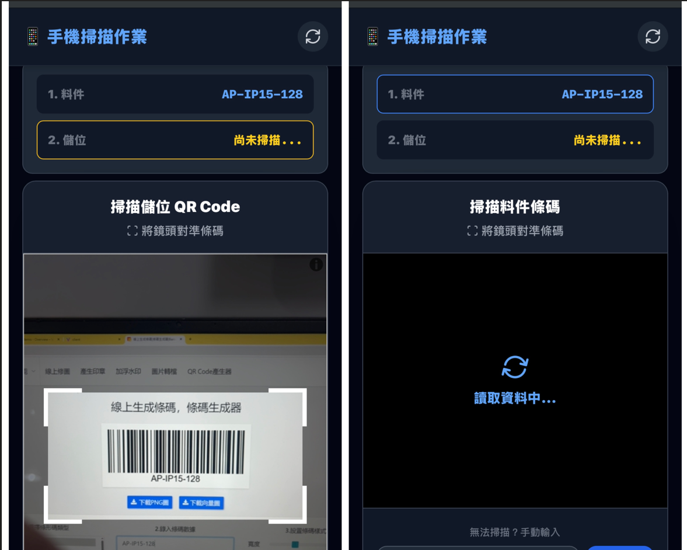
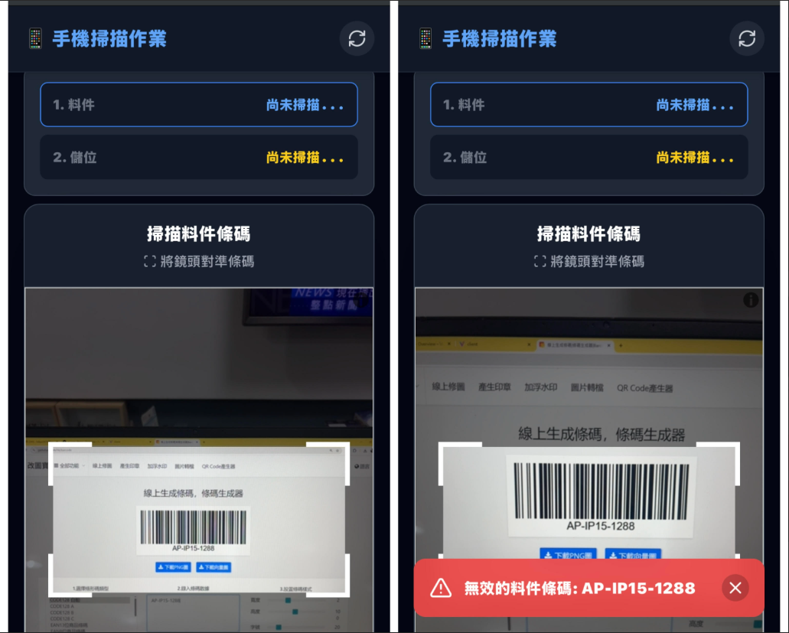
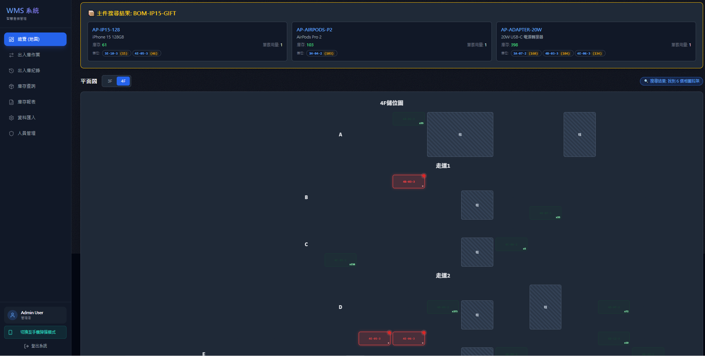
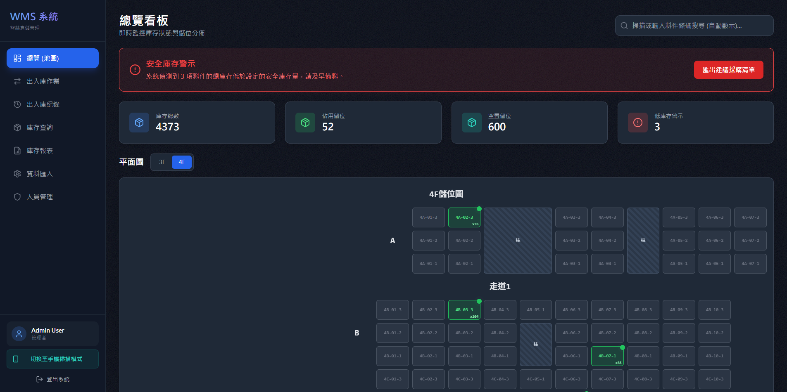

  
  <h1 style="color: #0c2461; border-bottom: 3px solid #00d2d3; padding-bottom: 12px; font-family: 'Segoe UI', sans-serif;">
    智慧倉儲動態管理系統 
  </h1>
  
 簡介信函

**✉️ 信件主旨：**
解決旺季出貨塞車：免買十萬 PDA 的AI智慧倉儲健檢與提案

---

**[巧居醬小舖] 負責人 / 老闆 您好，**

我是 Sky (starwish studio 產品開發團隊)，近期關注到貴公司業績成長快速，且正在擴編理貨與倉管團隊。

許多像貴公司一樣正處於訂單爆發期的企業，常面臨以下痛點：
❌ **依賴老手記憶**：新人找貨慢、記不住複雜儲位，出錯貨導致客訴頻傳？
❌ **硬體成本高昂**：想導入條碼管理，但傳統盤點機 (PDA) 動輒數十萬？
❌ **系統笨重難推**：市面上的 ERP 架構龐大，阿姨與基層員工根本學不會？

為此，我們開發了專為台灣中小企業量身打造的 **「AI WMS 2.0 智慧倉儲管理系統」**。這是一套最輕量、最直覺、**完全免安裝硬體設備**的解決方案：

### 📱 1. 手機就是掃描槍：設備成本趨近於零
不需要購買昂貴的工業用 PDA！員工只需使用自己的智慧型手機開啟網頁，即可掃描條碼。內建非同步防呆機制，只要刷錯商品或走錯儲位，手機畫面立即跳出紅色警告並阻擋入庫，讓阿姨也能輕鬆做到零錯件。

### 🗺️ 2. 視覺化 2D 地圖導航：新人首日即戰力
告別密密麻麻的紙本進出庫單！系統擁有獨家「動態儲位地圖」，當收到包含多種零組件的訂單時（支援 BOM 表展開），地圖上對應的儲位會自動亮起「紅色呼吸燈」。新人只要看著螢幕哪裡亮燈就去哪裡拿貨，徹底釋放老手帶新人的時間成本。

### 📊 3. 即時戰情室 (Dashboard)：老闆的專屬千里眼
告別落落長的 Excel 報表！打開網頁，廠區的即時進出庫動態、各儲位容積率一目了然。系統內建「安全庫存警示引擎」，只要料件低於安全水位，儀表板立刻出現醒目紅字警告，並可一鍵匯出「建議採購清單」，無縫接軌採購流程。

---

### 💡 為什麼選擇 starwish studio？

* **極速無痛導入**：不需建置機房，今天確認合作，我們最快能在 **48 小時內**為您開通專屬系統並完成初始資料匯入。
* **資料絕對安全**：提供「雲端 SaaS 訂閱制」與「廠內落地買斷制」雙軌方案。具備企業級 ACID 資料防護，斷電不毀損，且完整紀錄每筆進出庫人員與時間，咎責清清楚楚。
* **無負擔的定價**：免去傳統幾十萬的初期建置費，用極低的門檻讓您的倉儲數位轉型一次到位。

---

### 🎁 專屬您的 15 分鐘線上展示與免費健檢

口說無憑，我們希望能與您安排一次 **10 到 15 分鐘的線上短會議**。我將直接操作系統畫面給您看，展示它能如何解決您眼前的庫存難題。若貴廠區有實地評估需求，我們也提供現場的倉儲動線免費健檢。

即使目前沒有立刻導入的計畫，當作交流業界數位轉型的經驗也非常歡迎！期待您的回覆。

敬祝 商祺，

**Sky** starwish studio 業務暨開發部  
📧 Email: [liskyo5470@gmail.com]  
📞 連絡電話: [0919675120]  
🌐 系統線上展示：[https://ai-wms-demo.vercel.app/dashboard]  